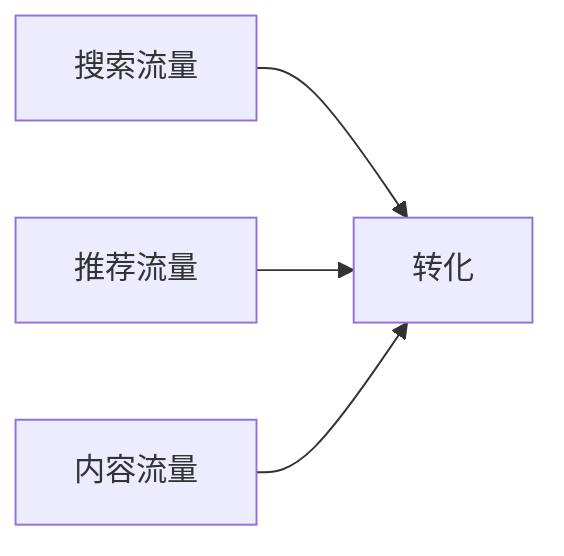

# 电商培训核心知识

> 本笔记由 Claude 协助创建，系统梳理电商运营的核心知识点

## 📊 电商运营框架

### 1. 平台认知
| 平台 | 特点 | 目标用户 |
|------|------|----------|
| 淘宝/天猫 | 流量大，竞争激烈 | 全品类用户 |
| 京东 | 品质保障，物流快 | 注重品质用户 |
| 拼多多 | 价格敏感，下沉市场 | 价格敏感型用户 |
| 抖音电商 | 兴趣推荐，内容驱动 | 年轻群体 |

### 2. 店铺搭建要素
- [ ] **选品策略**: 市场调研 + 竞品分析
- [ ] **视觉设计**: 店铺装修 + 主图详情页
- [ ] **标题优化**: 关键词布局 + 搜索权重
- [ ] **价格体系**: 成本核算 + 定价策略

---

## 🎯 流量获取

### 免费流量


1. **搜索优化 (SEO)**
   - 标题关键词布局
   - 属性填写完整
   - 宝贝上下架时间

2. **内容营销**
   - 短视频种草
   - 直播带货
   - 图文内容

### 付费流量
- **直通车**: 关键词竞价
- **钻展**: 品牌曝光
- **超级推荐**: 兴趣推荐

---

## 💰 转化率优化

### 影响转化的核心因素

| 因素 | 优化方向 |
|------|----------|
| 主图 | 点击率 (CTR) |
| 详情页 | 跳失率、停留时长 |
| 评价 | 信任度、转化率 |
| 客服 | 咨询转化率 |
| 活动 | 爆发力、销量 |

### 转化公式
```
销售额 = 流量 × 转化率 × 客单价
```

---

## 📦 客户管理

### 复购率提升策略
1. **会员体系**: 等级权益设计
2. **私域运营**: 微信社群维护
3. **CRM管理**: 用户画像分析
4. **售后服务**: 退换货处理

### 用户生命周期
```
新客 → 首购 → 复购 → 忠诚客户 → 口碑传播
```

---

## 📈 数据分析

### 核心数据指标
- **UV/PV**: 访客数/浏览量
- **CTR**: 点击率
- **CVR**: 转化率
- **ROI**: 投入产出比
- **GMV**: 成交总额

### 分析维度
- 流量来源分析
- 竞品数据分析
- 用户行为分析
- 销售趋势分析

---

## 🚀 运营策略

### 新品启动
1. **测款**: 小预算测试市场反应
2. **测图**: 对比不同主图点击率
3. **打标**: 获取精准人群标签
4. **放量**: 确认效果后加大投入

### 活动策划
- 日常活动: 优惠券、满减
- 大促活动: 618、双11
- 节日营销: 节日主题促销

---

## 📝 学习路径

### 第一阶段：基础认知
- [ ] 了解平台规则
- [ ] 掌握后台操作
- [ ] 学习基础术语

### 第二阶段：技能提升
- [ ] 选品能力
- [ ] 视觉审美
- [ ] 文案撰写
- [ ] 数据分析

### 第三阶段：进阶实战
- [ ] 爆款打造
- [ ] 品牌建设
- [ ] 团队管理

---

## 🔗 相关笔记
- [[欢迎来到Obsidian]]

## 📌 待办事项
- [ ] 完成竞品分析报告
- [ ] 制定本月运营计划
- [ ] 学习数据分析工具
- [ ] 优化店铺视觉设计

---

*笔记创建于 2026-03-24 | 持续更新中*
